Basics of SSH tunnels
=====================

Requirements
------------

Three components will be used in this workshop.

-   An SSH server.\
    This server will be provided (Oracle Cloud Infrastructure compute
    instance) but will be configured so you can use a private key to
    login

-   An SSH client.\
    The SSH client will be used to create an SSH tunnel and function as
    local SOCKS proxy server

-   A browser.\
    The browser will use the local SOCKS proxy server to access the
    internet via the SSH tunnel

Graphically the setup will look as followed:

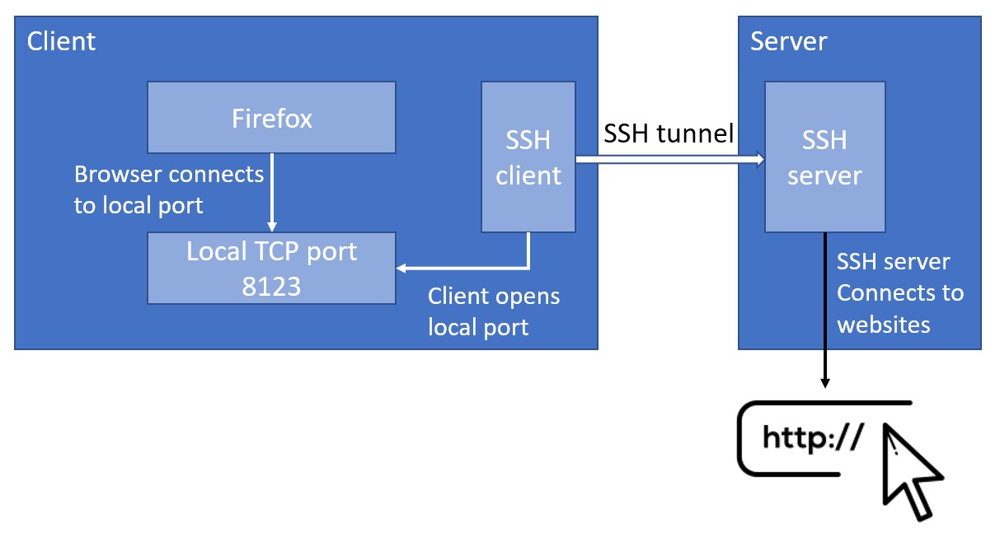{width="6.268055555555556in"
height="3.3430555555555554in"}

### Server environment

For this workshop, a remote SSH server and accounts are provided. The
accounts are only available during this workshop. Do you want to try
this out for yourself, create your own always free OCI instance at
cloud.oracle.com. A description on how to do this is provided at:

<https://technology.amis.nl/2020/02/23/secure-browsing-using-a-local-socks-proxy-server-on-desktop-or-mobile-and-an-always-free-oci-compute-instance-as-ssh-server/>

Use SSH server: 132.145.250.238 port 443

User accounts: wsuser1 to wsuser30

Passwords: WsusAMIS\_1 to WsusAMIS\_30 (number corresponds to username)

### SSH client

You can choose from several tools to use as SSH client and SOCKS proxy
server, depending on which you want to try.

#### MacOS / Linux / UNIX

The regular ssh client (preinstalled on all known systems) will be used
to configure the SSH account and create a tunnel + SOCKS proxy server.

For Linux and Unix you need to have an SSH client installed. Usually it
already is (such as for Mac OS). If not, install it first.

Debian, Ubuntu and similar: sudo apt install openssh-client

Red Hat, Fedora and similar: sudo yum install openssh-clients

#### Windows

MobaXterm will be used as SSH client to configure the server account and
software to configure the tunnel / SOCKS proxy server. You can download
it at <https://mobaxterm.mobatek.net/>. After downloading, install it.

#### Android

For Android phones you can use ConnectBot as SSH client (although typing
on a mobile phone can be bothersome) and as SSH tunnel configuration
tool / SOCKS proxy server. ConnectBot can be downloaded and installed
from the Google playstore here:
<https://play.google.com/store/apps/details?id=org.connectbot&hl=en>

### Firefox browser

You need a browser to use the SOCKS proxy server. Firefox is available
for Linux, Mac, Android and can be configured to use a SOCKS proxy
server. In this workshop Firefox will be used. You can download it here:
<https://www.mozilla.org/en-US/firefox>

Generating a public and private key
-----------------------------------

In order to login to the SSH server, a private key will be used. A
public key needs to be present in authorized\_keys file on the SSH
server.

First we will generate a public and private key pair to use. Next we
will login using a username/password to the SSH server and register the
public key.

You can choose to do this by command line or by using a GUI. You do not
need to do both.

### CLI: Linux/Unix/Mac or inside a MobaXterm terminal

Start a terminal

ssh-keygen -t rsa -m PEM -C \"youremail\@email.com\" -f rsakey

This generates two files in the current directory:

Private key: rsakey

Public key: rsakey.pub

rsakey is the private key used to login. rsakey.pub is the public key
which will be registered on the SSH server

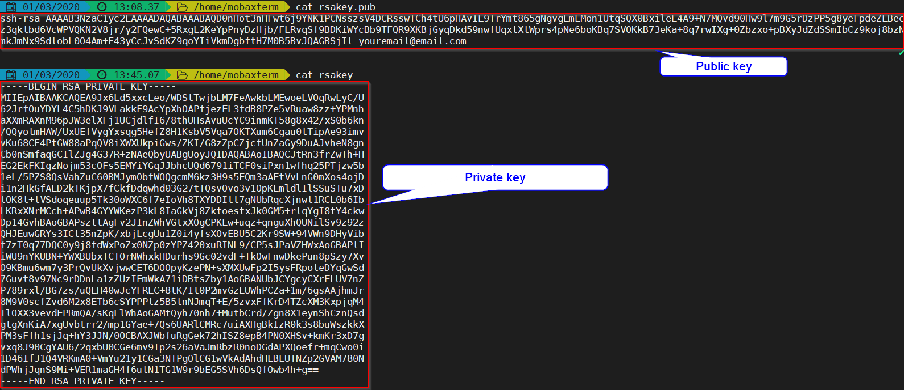{width="6.268055555555556in"
height="2.713888888888889in"}

### GUI: MobaXterm / PuTTYgen

An alternative to executing shell commands to generate a keypair is by
using tools like MobaXterm / PuTTYgen. PuTTYgen is available for
Windows, Mac and Linux. MobaXterm only for Windows.

From MobaXterm you can start the MobaXterm SSH Key Generator.
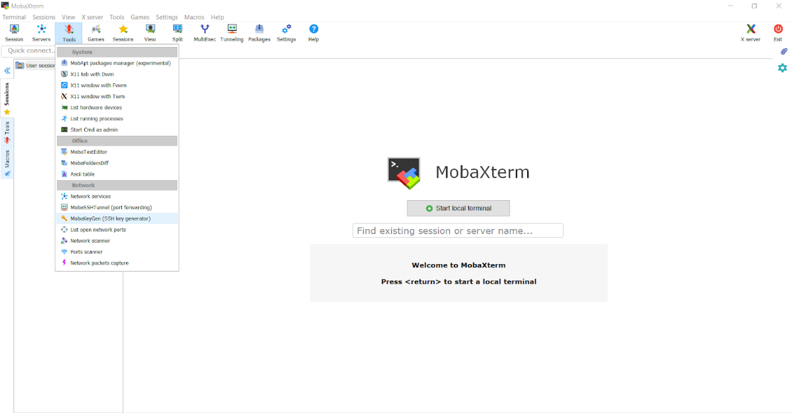{width="5.724512248468941in"
height="2.9916666666666667in"}

First generate a keypair

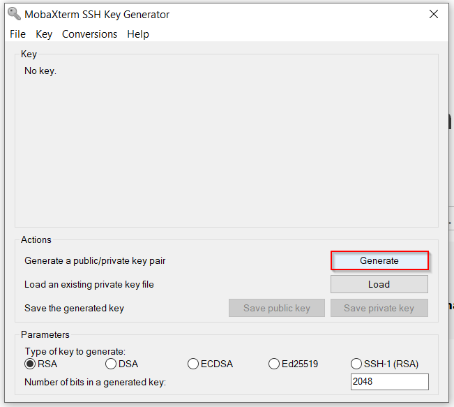{width="4.125012029746282in"
height="3.691666666666667in"}

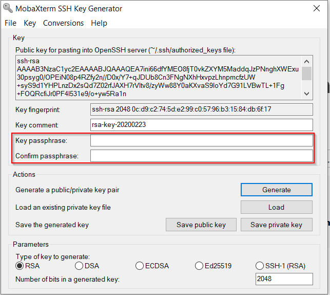{width="4.918694225721785in"
height="4.388888888888889in"}

Mind that when saving the public and private key, not to supply a
passphrase. Not every client can deal with that.

Copy the key as displayed in the 'Public key for pasting into OpenSSH
server (\~/.ssh/authorized\_keys)' and save it in a separate file for
later usage. For example openssh\_key.key

Save the public key and private keys to separate files. For example
pubkey and privkey. You will use the privkey to login.

Testing connectivity
--------------------

Use your preferred SSH client to test connectivity to the SSH server and
login. Remember to use the following credentials:

Use SSH server: 132.145.250.238 port 443

User accounts: wsuser1 to wsuser30

Passwords: WsusAMIS\_1 to WsusAMIS\_30 (number corresponds to username)

### MobaXterm

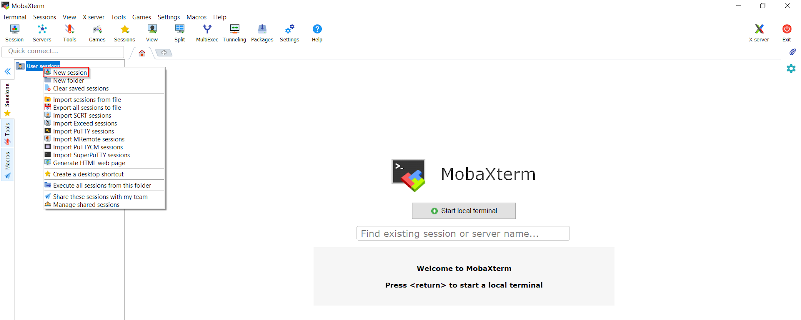{width="3.9166666666666665in"
height="2.5088965441819773in"}

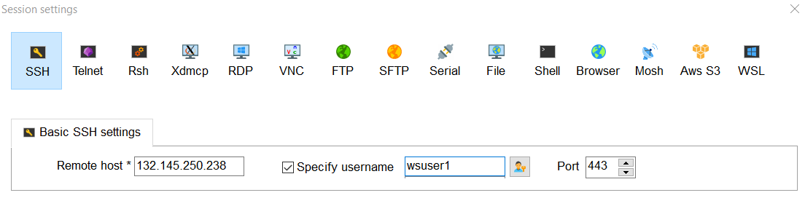{width="5.712962598425197in"
height="1.407668416447944in"}

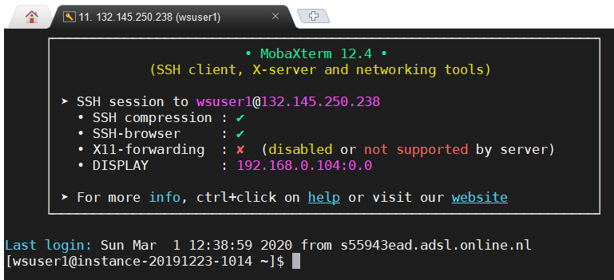{width="6.268055555555556in"
height="2.861111111111111in"}

### CLI: Linux, Mac

ssh <wsuser1@132.145.250.238> -p 443

### Android: ConnectBot (possible but not recommended)

Start ConnectBot. Click the + icon at the bottom of the screen.

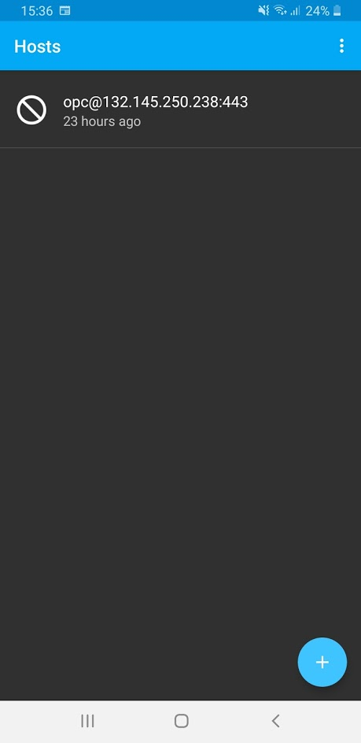{width="2.9347222222222222in"
height="6.030729440069991in"}

Input the following properties:

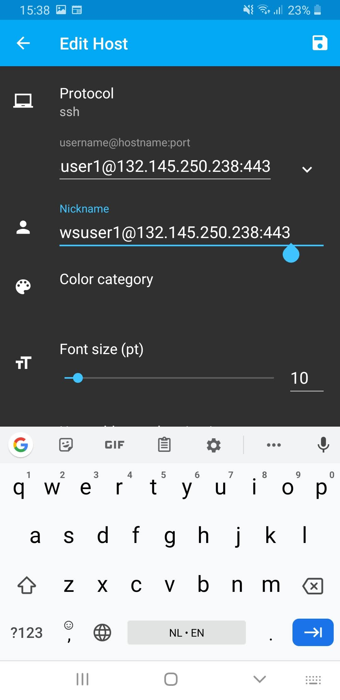{width="2.935184820647419in"
height="3.5555555555555554in"}

Connect to the newly created host by tapping it. Type your password.

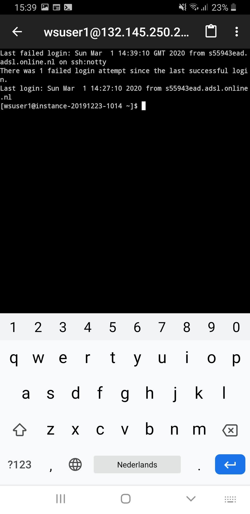{width="2.9347222222222222in"
height="1.5228280839895012in"}

Confirm you are connected.

Add the public key
------------------

You have previously copied a public key which looks something like:

ssh-rsa
AAAAB3NzaC1yc2EAAAABJQAAAQEAqtGsoOOTD9A3pPMDbEijYSxO375SrV1s25bkFXs7U2WLWKQcr/ApafOVeWvocjr+ZSuDzzD4f9VT7wfmb8LWm4yurDFWKdSEJRujEBndpTJDtBnboJYvZoSz6A3An8vRyxTjwqDQhZURiVMEt0D40WJBy64Mu25x2LHIneNfL5h6wP4nGQ4AD+OjbOUEd4OjTaEUx+YWHZkqNj4aQ091SqdYuaokYeUgzkub9HMKTxDB7OQOoFTN5GKiXGZtnl4exGEcfCSqZd8rnmo6YF++gcsseJabtaQ+GznPs4AiDoaX9r3F1UoARFwMMNN4APejmCBNkGdjCi+7ESmROyMTXQ==
rsa-key-20200301

This public key will be added to the \~/.ssh/authorized\_keys file.

Execute the following commands (using a CLI) to create the required
folders, the file and set the correct permissions:

mkdir \~/.ssh

chmod 700 \~/.ssh

touch \~/.ssh/authorized\_keys

chmod 600 \~/.ssh/authorized\_keys

Now add the public key to the authorized\_keys file. You can do this in
multiple ways

### MobaXterm (Windows)

After the authorized\_keys file is created, you can edit it with the
MobaTextEditor by opening it from the Scp tab on the left. If you cannot
immediately see the .ssh folder, click the refresh button or press F5.
Paste the public key into this file and save it (the red disk icon).
Confirm you want to overwrite the file on the server.

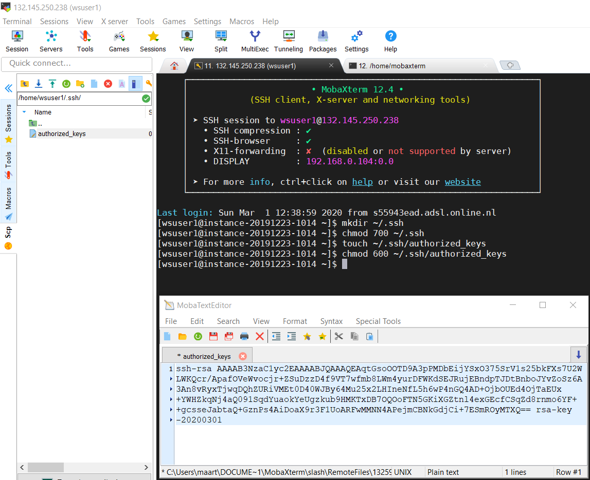{width="6.268055555555556in"
height="5.1090277777777775in"}

### CLI: Linux, Mac

You can also use a CLI to add the public key such as:

cat LocationOfOpenSSHPublicKey \>\> \~/.ssh/authorized\_keys

Or edit \~/.ssh/authorized\_keys with vi (or any other editor) and add
the public key

Creating an SSH tunnel / SOCKS proxy server
-------------------------------------------

### MobaXterm (Windows)

MobaXterm provides a nice interface to configure a tunnel with. First
start the interface.

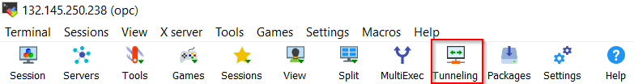{width="6.26875in"
height="0.8333333333333334in"}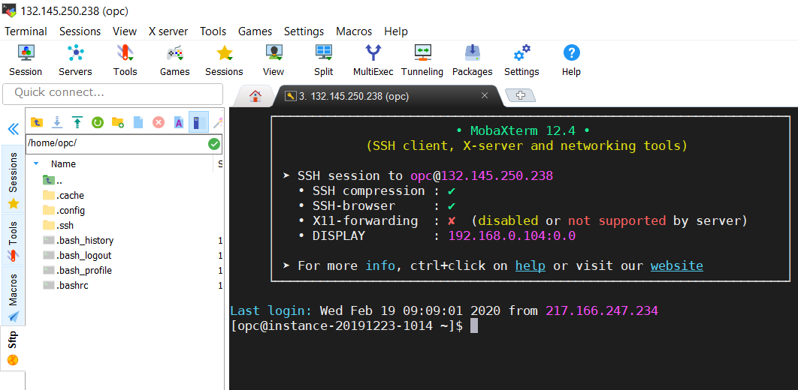{width="6.259027777777778in"
height="3.064583333333333in"}

Next configure the connection details as indicated below. Replace opc
with your
wsuser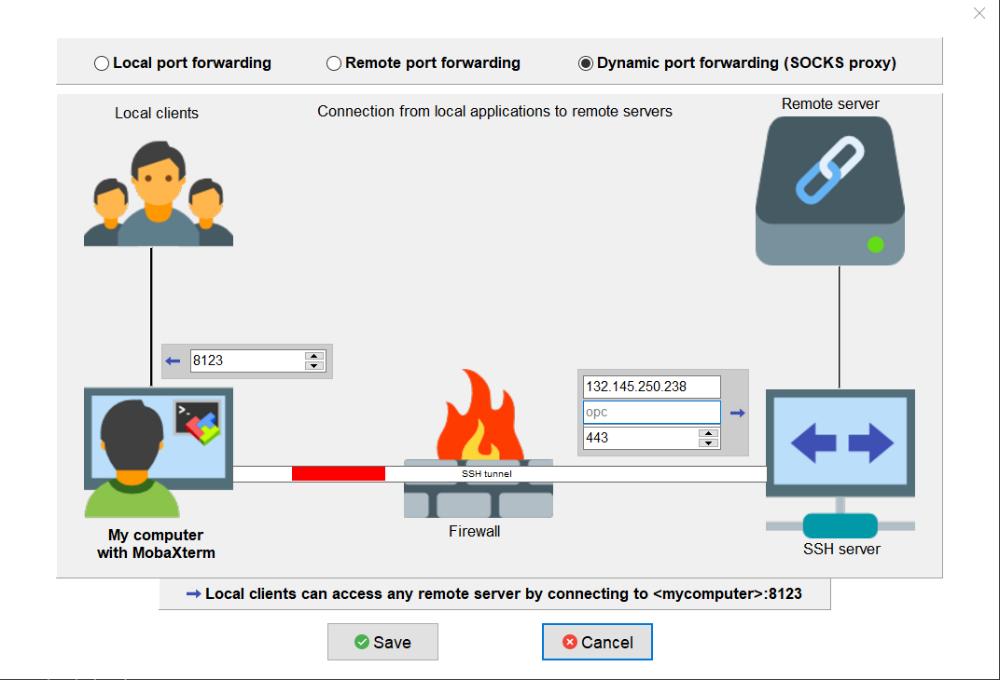{width="6.268055555555556in"
height="4.268277559055118in"}

Configure the private key to use and start the tunnel / SOCKS proxy
server.

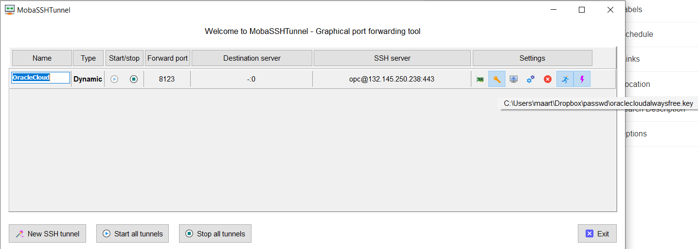{width="6.259027777777778in"
height="2.240972222222222in"}

### CLI (UNIX, Linux, Mac)

Using the SSH command you can create an SSH tunnel / local proxy server

nohup ssh -i \~/oraclecloudalwaysfree.key -D 8123 -f -C -v -N
opc\@132.145.250.238 -p 443

Here also replace opc with your wsuser.

-   -D 8123 starts a SOCKS 4 and SOCKS 5 compliant proxy server on port
    8123

-   -i indicates the private key to use

-   -f indicates background execution of SSH

-   -C requests compression of data

-   -v gives verbose output. Useful for debugging

-   -N indicates no remote command needs to be executed. we just need
    the tunnel functionality

-   -p indicates the port to connect to on the remote host.

-   opc\@132.145.250.238 indicates the user and host to connect to

You can monitor the proxy server by checking out \~/nohup.out

### ConnectBot (Android)

Add the private key. Click Manage Pubkeys.

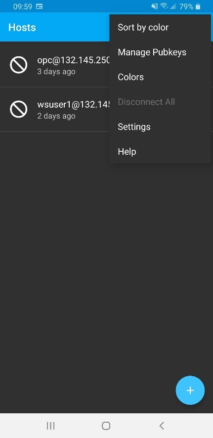{width="1.9402504374453193in"
height="3.987133639545057in"}

Select your private key. For getting the key to your mobile phone, you
can mail it to yourself, download it from the mail and select it from
the Downloads folder.

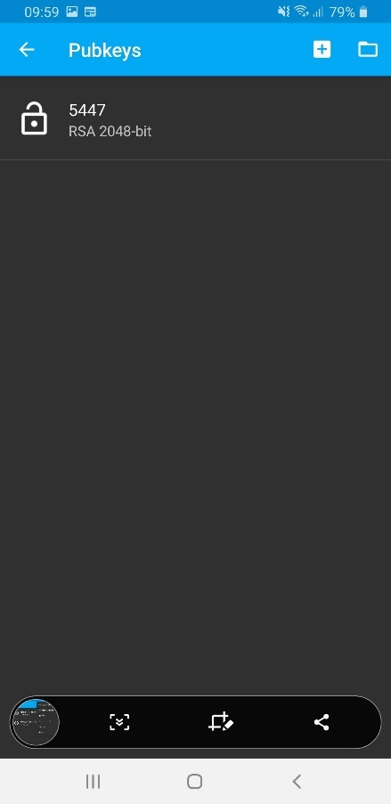{width="1.983008530183727in"
height="4.075in"}

Configure the key to load on startup and unlock the key

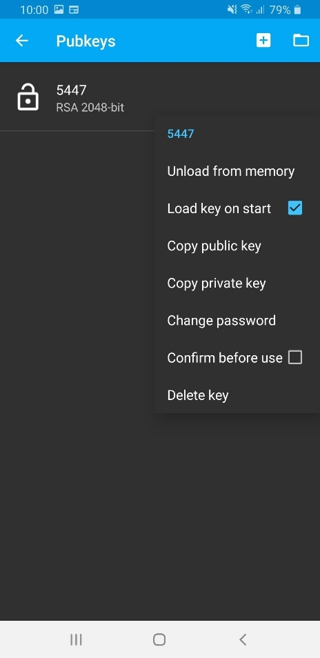{width="2.080333552055993in"
height="4.275in"}

Configure port forwards

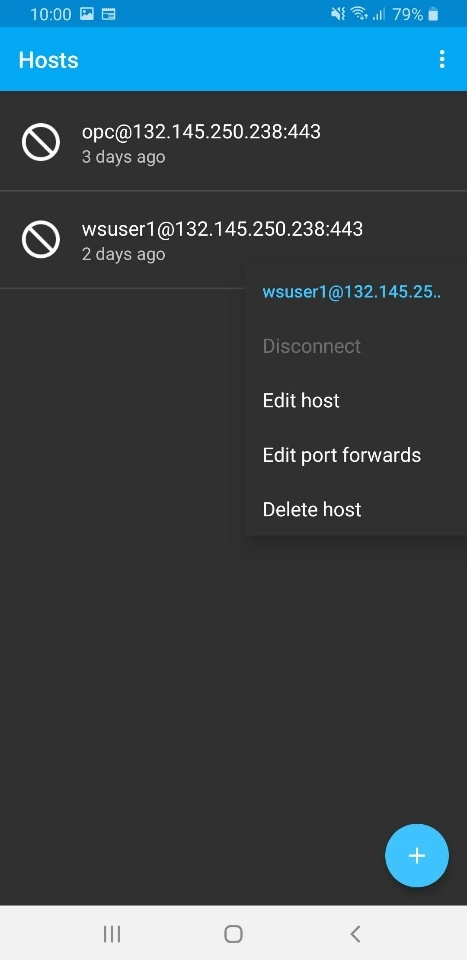{width="2.104666447944007in"
height="4.325in"}

Add a new port forward and use the settings as described below. A
dynamic SOCKS proxy on port 8123

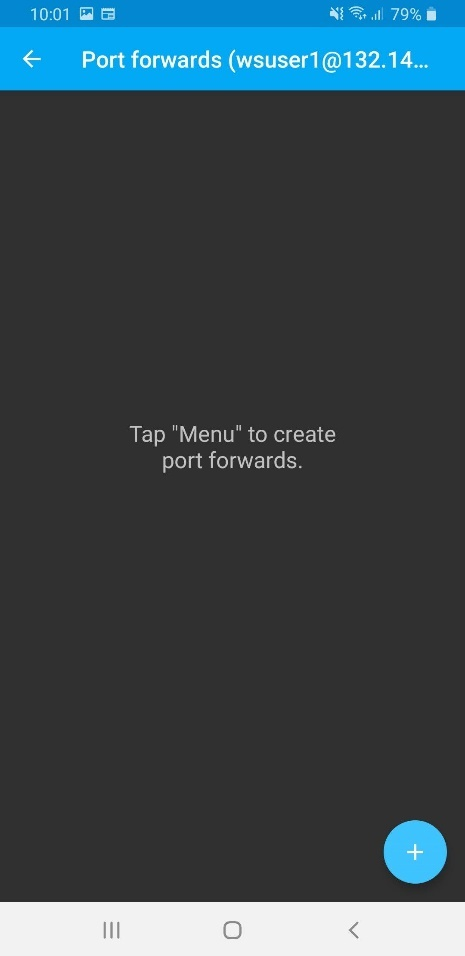{width="2.079851268591426in"
height="4.274005905511811in"}

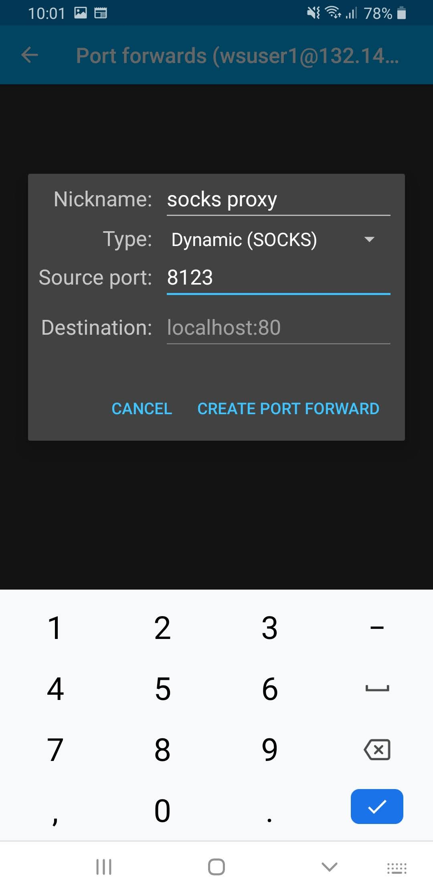{width="2.3472222222222223in"
height="2.4833333333333334in"}

Configuring clients
-------------------

### Firefox desktop (Linux, Windows, Mac)

Open the Firefox preferences and search for proxy. Open the Network
settings

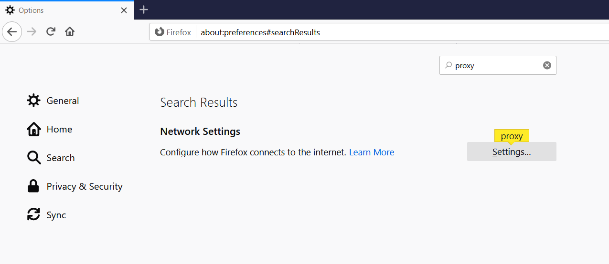{width="6.258333333333334in"
height="2.716666666666667in"}

Configure the SOCKS proxy server to use.
localhost:8123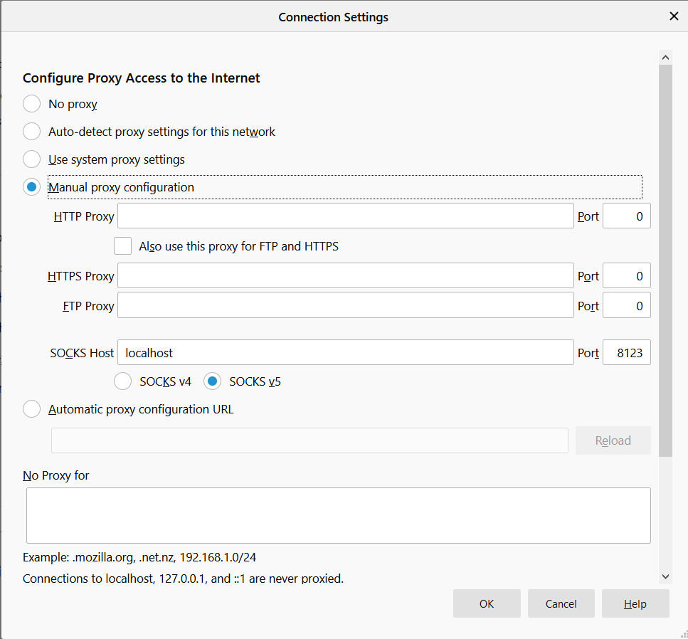{width="6.266666666666667in"
height="5.816666666666666in"}

### Firefox mobile (Android)

For Firefox on a mobile device this is slightly harder, but on for
example Chrome, these settings are not available at all. In Firefox the
same settings as described above are available but not nicely from a
GUI. The following here describes the steps you need to take.

In the firefox URL bar, type 'about:config' and press enter to access
advanced settings. Search for 'socks' and set the following settings:

-   network.proxy.socks = 127.0.0.1

-   network.proxy.socks\_port = 8123

-   network.proxy.socks\_remote\_dns = true

Search for 'proxy.type' and set the following setting:

-   network.proxy.type = 1

Access the web using a remote server
------------------------------------

Now confirm you can access the web using your OCI instance by going to
[www.whatismyip.com](http://www.whatismyip.com) and check that Oracle
Public Cloud is your ISP.

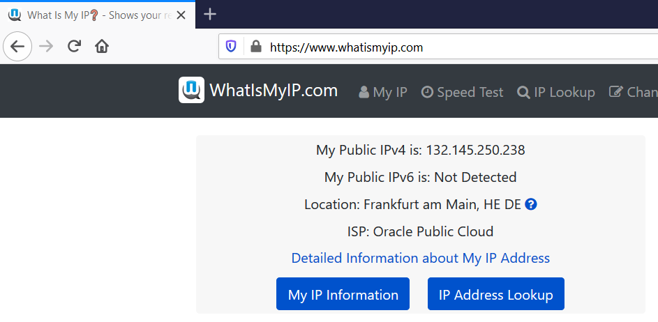{width="6.268055555555556in"
height="3.0708333333333333in"}
